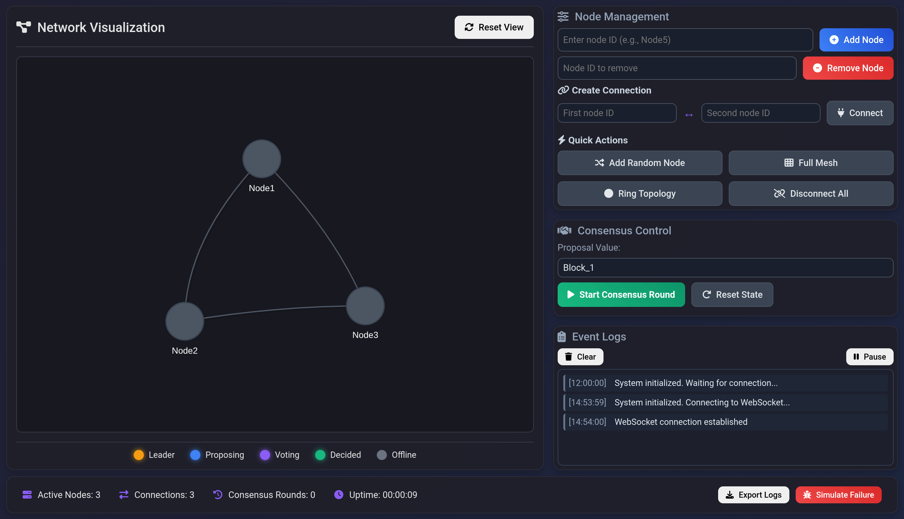
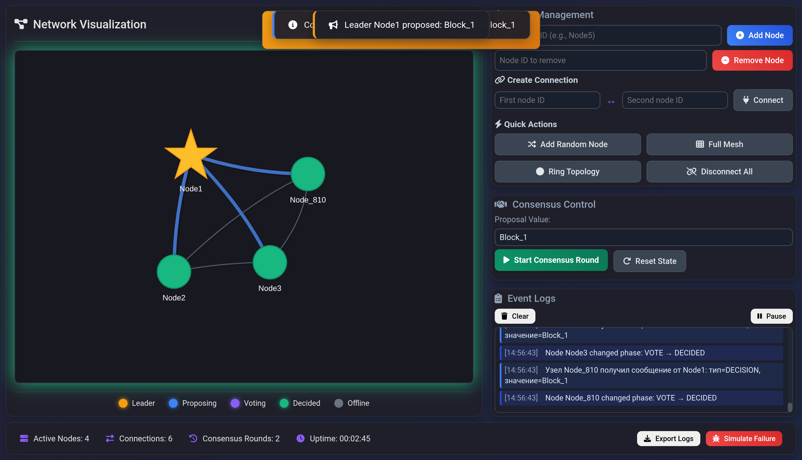

# Consensus Network Simulator 

## Описание проекта

**Consensus Network Simulator** - это симуляция для демонстрации алгоритмов достижения консенсуса в распределенных сетях. Проект позволяет наглядно наблюдать процесс консенсуса между узлами сети, включая выбор лидера, рассылку предложений, голосование и принятие коллективного решения.

## Основные возможности

- **Визуализация сети**: Графическое представление узлов и соединений
- **Динамический консенсус**: Пошаговая демонстрация алгоритма консенсуса
- **Управление узлами**: Добавление/удаление узлов, изменение их состояния
- **Гибкая топология**: Создание различных типов сетей (полносвязная, кольцевая)
- **Реальное время**: Мониторинг событий и статистики в реальном времени
- **Визуальные эффекты**: Анимации для наглядного представления процессов

## Архитектура проекта

Проект состоит из следующих компонентов:

### Backend (Go)
- **`main.go`** - Точка входа, инициализация сервера и маршрутизация
- **`network/`** - Ядро сетевой симуляции
  - `network.go` - Основная структура сети и управление узлами
  - `node.go` - Реализация отдельных узлов сети
  - `consensus.go` - Состояние консенсуса
- **`websocket/`** - Реализация WebSocket хаба для реального взаимодействия
  - `hub.go` - Хаб для управления клиентскими соединениями

### Frontend (HTML/JavaScript/CSS)
- **`static/index.html`** - Основной интерфейс пользователя
- **`static/app.js`** - Основная логика фронтенда и визуализации
- **`static/style.css`** - Стили интерфейса


## Запуск

1. **Запустите сервер**:
   ```bash
   go run main.go
   ```

2. **Откройте браузер** и перейдите по адресу:
   ```
   http://localhost:8080
   ```

## Руководство по использованию

### Основные функции

#### 1. Управление узлами
- **Добавить узел**: Введите ID узла и нажмите "Add Node"
- **Удалить узел**: Введите ID узла и нажмите "Remove Node"
- **Создать соединение**: Укажите два узла и нажмите "Connect"

#### 2. Быстрые действия
- **Add Random Node**: Добавить случайный узел
- **Full Mesh**: Создать полносвязную сеть
- **Ring Topology**: Создать кольцевую топологию
- **Disconnect All**: Разорвать все соединения

#### 3. Консенсус
- **Start Consensus Round**: Начать раунд консенсуса
- **Reset State**: Сбросить состояние консенсуса
- **Simulate Failure**: Симулировать случайный сбой

## Технические детали

### Алгоритм консенсуса

Проект реализует упрощенный алгоритм консенсуса с лидером:

1. **Выбор лидера**: Автоматический выбор первого онлайн-узла
2. **Фаза предложения**: Лидер рассылает предложение всем узлам
3. **Фаза голосования**: Узлы голосуют за предложение лидера
4. **Принятие решения**: При получении большинства голосов решение принимается

### Компоненты сети

#### Узел (Node)
```go
type Node struct {
    ID           string           // Уникальный идентификатор
    Peers        map[string]*Node // Связанные узлы
    Consensus    *ConsensusState  // Состояние консенсуса
    MessageQueue chan Message     // Канал входящих сообщений
    IsOnline     bool             // Статус подключения
    // ... другие поля
}
```

#### Сообщения
- **PROPOSE**: Предложение значения для консенсуса
- **VOTE**: Голос за/против предложения
- **DECISION**: Финальное решение

## Особенности интерфейса

### Интерактивность
- **Двойной клик по узлу**: Переключение онлайн/офлайн состояния
- **Клик по узлу**: Просмотр детальной информации
- **Drag & Drop**: Перемещение узлов на визуализации

### Визуальные эффекты
- Анимация передачи сообщений между узлами
- Пульсация лидера и активных узлов
- Визуальное представление этапов консенсуса
- Эффекты при сбоях и восстановлениях

### Мониторинг
- Счетчик активных узлов и соединений
- Статистика раундов консенсуса
- Журнал событий в реальном времени
- Время работы системы

## WebSocket взаимодействие

Фронтенд взаимодействует с бэкендом через WebSocket соединение:

1. **Инициализация**: При подключении клиент получает текущее состояние сети
2. **Обновления**: Сервер рассылает обновления состояния всем подключенным клиентам
3. **Команды**: Клиент отправляет команды управления (добавить узел, начать консенсус и т.д.)

## Логирование и отладка

### Журнал событий
Система ведет подробный журнал событий:
- Добавление/удаление узлов
- Изменение состояния узлов
- Сообщения консенсуса
- Сетевые соединения
- Системные сообщения

### Экспорт логов
Возможность экспорта журнала событий в текстовый файл для анализа.

## Планы развития

### Возможные улучшения
- [ ] Поддержка различных алгоритмов консенсуса (Paxos, Raft)
- [ ] Более сложные сценарии сбоев (византийские отказы)
- [ ] Графики статистики в реальном времени
- [ ] Экспорт конфигурации сети

### Оптимизации
- [ ] Улучшение производительности для больших сетей
- [ ] Кэширование состояния для быстрого восстановления
- [ ] Адаптивная визуализация для мобильных устройств

### Скриншоты

**Основной интерфейс симулятора**

*Визуализация сети, панель управления и лог событий в реальном времени.*

**Активный раунд консенсуса**

*Лидер (жёлтый) провел голосование, зеленые узлы пришли к согласию*

---

*Проект создан для образовательных целей и демонстрации принципов распределенных систем.*